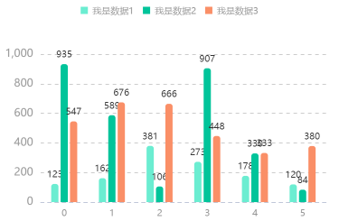
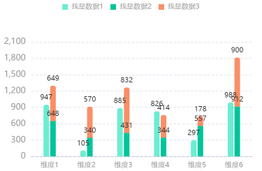
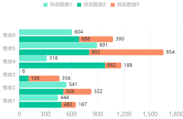
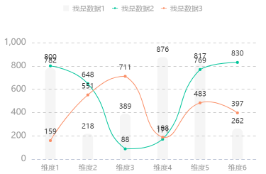

# install
```
npm install xl-chart --save-dev
```

# import
```
import xlChart  from "xl-chart"
```

# purpose
```
本插件是为BI和快速创建手机版本图表而建，提供了快速重载，销毁重载等性能优化
pc版 还在考虑开放ing，如果需要 可以私信 1772907731@qq.com
```

# use

## Normal

```js
const data = Array.from(Array(6).keys()).map((item)=>{
    return {
        num1:Math.floor(Math.random()*1000+1),
        num2:Math.floor(Math.random()*1000+1),
        record:"维度"+(item+1)
    };
});
new xlChart.Normal(
    dom,
    {
        data,
        dataField: ["num1", "num2"],
        recordField: "record",
        seriesField: {
            num1: {
                name: "我是数据1",
                type: "line",
                color: "#6BEDD1",
            },
            num2: {
                name: "我是数据2",
                type: "bar",
                color: "#00C49A"
            }
        }
    }
);

```

## StackX

```js
const data = Array.from(Array(6).keys()).map((item)=>{
    return {
        num1:Math.floor(Math.random()*1000+1),
        num2:Math.floor(Math.random()*1000+1),
        record:"维度"+(item+1)
    };
});
new xlChart.StackX(
    dom,
    {
        data,
        dataField: ["num1", "num2"],
        recordField: "record",
        seriesField: {
            num1: {
                name: "我是数据1",
                type: "bar",
                stack:"1",
                color: "#6BEDD1",
            },
            num2: {
                name: "我是数据2",
                type: "bar",
                stack:"1",
                color: "#00C49A"
            }
        }
    }
);

```


## StackY

```js
const data = Array.from(Array(6).keys()).map((item)=>{
    return {
        num1:Math.floor(Math.random()*1000+1),
        num2:Math.floor(Math.random()*1000+1),
        record:"维度"+(item+1)
    };
});
new xlChart.StackY(
    dom,
    {
        data,
        dataField: ["num1", "num2"],
        recordField: "record",
        seriesField: {
            num1: {
                name: "我是数据1",
                type: "bar",
                stack:"1",
                color: "#6BEDD1",
            },
            num2: {
                name: "我是数据2",
                type: "bar",
                stack:"1",
                color: "#00C49A"
            }
        }
    }
);

```

## BarGrey

```js
const data = Array.from(Array(6).keys()).map((item)=>{
    return {
        num1:Math.floor(Math.random()*1000+1),
        num2:Math.floor(Math.random()*1000+1),
        record:"维度"+(item+1)
    };
});
new xlChart.BarGrey(
    dom,
    {
        data,
        dataField: ["num1", "num2"],
        recordField: "record",
        seriesField: {
            num1: {
                name: "我是数据1",
                type: "line",
                color: "#6BEDD1",
            },
            num2: {
                name: "我是数据2",
                type: "bar",
                color: "#00C49A"
            }
        }
    }
);

```

## BarExtreme

```js
const data = Array.from(Array(6).keys()).map((item)=>{
    return {
        num1:Math.floor(Math.random()*1000+1),
        num2:Math.floor(Math.random()*1000+1),
        record:"维度"+(item+1)
    };
});
new xlChart.BarExtreme(
    dom,
    {
        data,
        dataField: ["num1", "num2"],
        recordField: "record",
        seriesField: {
            num1: {
                name: "我是数据1",
                type: "bar",
                color: "#6BEDD1",
            },
            num2: {
                name: "我是数据2",
                type: "bar",
                color: "#00C49A"
            }
        }
    }
);

```


## Pie

```js
new xlChart.Pie(
        dom,
        {
           data:{
               num1:Math.floor(Math.random()*1000+1),
               num2:Math.floor(Math.random()*1000+1),
               num3:Math.floor(Math.random()*1000+1),
           },
           dataField: ["num1", "num2", "num3"],
           seriesField: {
               num1: {
                   name: "我是数据1",
                   color: "#6BEDD1",
               },
               num2: {
                   name: "我是数据2",
                   color: "#00C49A"
               },
               num3: {
                   name: "我是数据3",
                   color: "#FA8F67"
               }
           }
        }
);

```


#reload
```js
//可以更新任意值
const chart = new xlChart.Normal({});
chart.reloadOption({
  data:[],
  dataField: ["num1", "num2", "num3"],
  seriesField: {
      num1: {
          name: "我是数据1",
          type: "bar",
          color: "#6BEDD1",
      },
      num2: {
          name: "我是数据2",
          type: "line",
          color: "#00C49A"
      },
      num3: {
          name: "我是数据3",
          type: "line",
          color: "#FA8F67"
      }
  }
});
```


#destroy

```js
// 销毁重构
const chart = new xlChart.Normal({});
chart.destroy();
```
