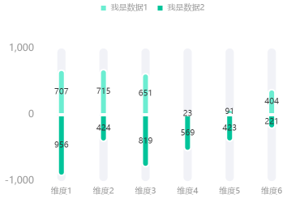
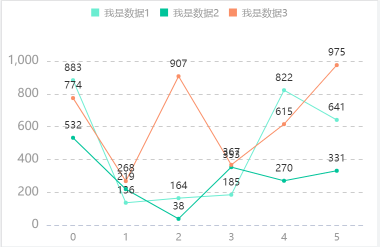
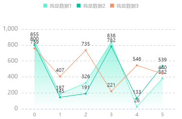
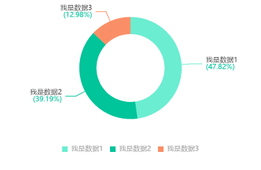

# install
```
npm install xl-chart --save-dev
```

# import
```
import xlChart  from "xl-chart"
```

# use

```
const data = Array.from(Array(6).keys()).map((item)=>{
    return {
        num1:Math.floor(Math.random()*1000+1),
        num2:Math.floor(Math.random()*1000+1),
        record:"维度"+(item+1)
    };
});
new xlChart.BarExtreme(
    dom,
    {
        data,
        dataField: ["num1", "num2"],
        recordField: "record",
        seriesField: {
            num1: {
                name: "我是数据1",
                type: "bar",
                color: "#6BEDD1",
            },
            num2: {
                name: "我是数据2",
                type: "bar",
                color: "#00C49A"
            }
        }
    }
);

```

# bar

# barExtreme

# barGrey

# line

# lineArea

# pie

# stackY

# stackX

